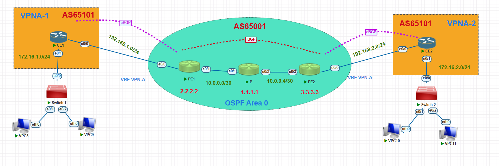

# Enterprise MPLS L3VPN Network Deployment

**Author:** Phạm Nguyễn Khánh  
**Major:** Computer Network and Data Communication  

## 1. Project Overview
This project simulates an Enterprise Core Network using MPLS L3VPN (Option A). It connects two branch offices (Hanoi and Saigon) across an ISP core network, ensuring secure and isolated routing using VRF and MP-BGP. 

## 2. Network Topology

## 3. Technologies Implemented
* **Underlay Routing:** OSPF (Area 0) within the ISP Core.
* **Overlay Routing:** MP-BGP (VPNv4) between Provider Edge (PE) routers.
* **Customer Routing:** eBGP between PE and CE (Customer Edge) routers.
* **Traffic Isolation:** VRF (Virtual Routing and Forwarding) for VPN-A.
* **Label Switching:** LDP enabled on core links (`mpls ip`).
* **Routing Loop Resolution:** Implemented `as-override` on PE routers to bypass BGP loop prevention mechanism (due to identical AS 65101 at both sites), ensuring route propagation.

## 4. Verification
* End-to-end reachability confirmed via ICMP Echo (`ping`) from VPCS in Hanoi to VPCS in Saigon.
* MPLS label switching verified via `trace` command, demonstrating packet traversal through Provider core using labels.

## 5. Future Improvements
* Integrate Java (e.g., using JSch library) to build a custom Network Automation script for dynamically pushing CLI configurations and fetching routing tables via SSH, replacing manual CLI inputs.

## 6. How to Install & Run

This repository includes the exported PnetLab/EVE-NG topology and the required Cisco IOL images to run the lab.

### Prerequisites
* PnetLab or EVE-NG installed on your local machine or server.
* WinSCP, FileZilla, or any SFTP client.

### Step 1: Import the Lab Topology
1. Download the exported lab file from https://drive.google.com/drive/folders/1agp-7ylJa18vVc8ms_b1iiJDCyW8YfzI?usp=sharing 
2. Open your PnetLab web interface.
3. Click the **Import** button on the main dashboard and select the downloaded file to upload the topology.

### Step 2: Upload Cisco IOL Images
This lab uses specific Cisco IOL images (located in the `Images/` folder of this repository). You need to upload them to your PnetLab server.
1. Connect to your PnetLab CLI via SFTP (using WinSCP/FileZilla) with `root` credentials.
2. Upload the `.bin` files from the `Images/` folder to the following directory on the server:
   `/opt/unetlab/addons/iol/bin/`
3. Ensure that your IOU license file (`iourc`) is also present in that directory to run the images.

### Step 3: Fix Permissions (Crucial)
After uploading the image files, you must fix the folder permissions to prevent startup errors.
1. SSH into your PnetLab server as `root`.
2. Run the following command:
   `/opt/unetlab/wrappers/unl_wrapper -a fixpermissions`

### Step 4: Start the Lab
1. Open the imported lab in the PnetLab web interface.
2. Select all nodes, right-click, and choose **Start**.
3. (Optional) If configurations are not automatically loaded from the NVRAM, copy and paste the configurations from the `Configurations/` folder manually.